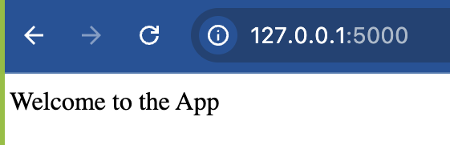
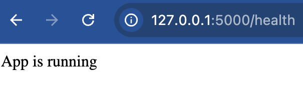
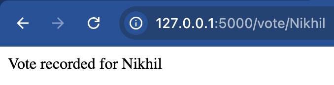
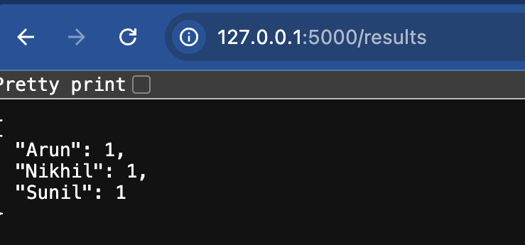
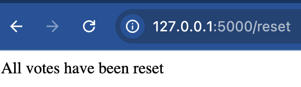
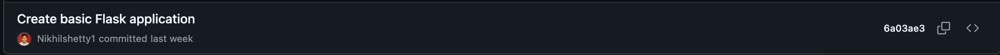
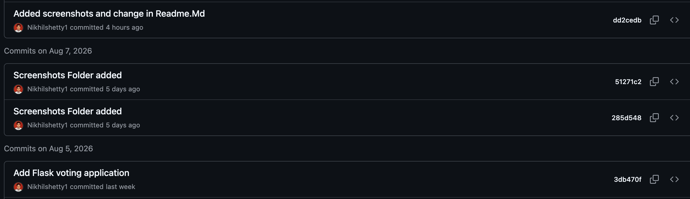
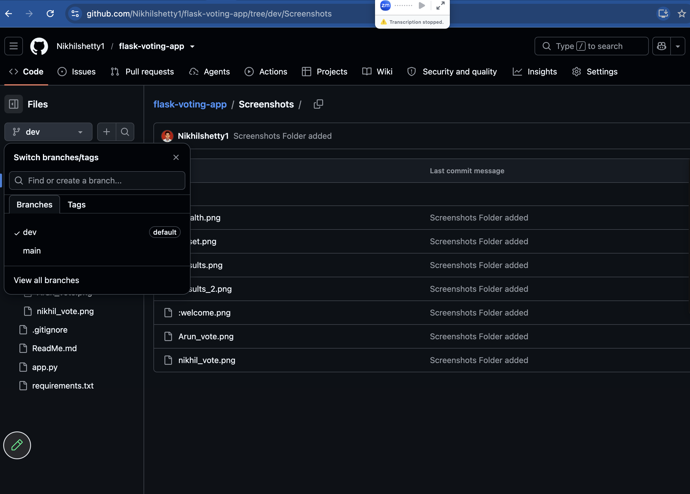
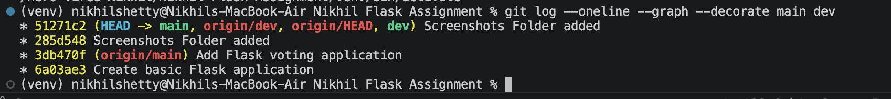

# Flask Voting Application

## Project Description

This project is a simple Flask web application that provides a basic voting system. Users can vote for candidates by using a URL, view the current vote counts, and reset all stored votes. The application stores voting information temporarily in memory while the application is running.

## Installation and Setup

### 1. Clone the repository

```bash
git clone YOUR_GITHUB_REPOSITORY_URL
cd flask-voting-app
```

### 2. Create a virtual environment

```bash
python3 -m venv venv
```

### 3. Activate the virtual environment

For macOS/Linux:

```bash
source venv/bin/activate
```

### 4. Install dependencies

```bash
pip install -r requirements.txt
```

### 5. Run the application

```bash
python3 app.py
```

The application will be available at:

```text
http://localhost:5000
```

## API Endpoint Reference

| Endpoint       | Method | Description                                               | Example Response            |
| -------------- | ------ | --------------------------------------------------------- | --------------------------- |
| `/`            | GET    | Displays the welcome message                              | `Welcome to the App`        |
| `/health`      | GET    | Checks whether the application is running                 | `App is running`            |
| `/vote/<name>` | GET    | Records one vote for the specified candidate              | `Vote recorded for Rahul`   |
| `/results`     | GET    | Returns the current vote count for all candidates as JSON | `{"Rahul": 2, "Priya": 1}`  |
| `/reset`       | GET    | Clears all stored vote counts                             | `All votes have been reset` |

## Git Workflow

This project uses two Git branches:

* `dev` — Used for all development work.
* `main` — Contains stable and working versions of the application.

Development follows this workflow:

```text
        Development
             ↓
           dev
             ↓
      Test the feature
             ↓
      Feature complete?
             ↓
      Merge dev → main
             ↓
       Stable release
```

Version 1 was developed and tested in `dev` before being merged into `main`.

Version 2 was developed on top of Version 1 in `dev`, tested, and then merged into `main`.

No application development was performed directly on `main`.

## Version History

| Version   | Features                                           |
| --------- | -------------------------------------------------- |
| Version 1 | Flask application with `/` and `/health` endpoints |
| Version 2 | Added `/vote/<name>`, `/results`, and `/reset`     |

## Screenshots

### 1. Application Running

* #### Welcome Screenshot


* #### Health Status


### 2. Voting App
Added voting users, /results, /reset
* #### Vote Recorded


* #### Vote Results


* #### Reset


### 3. Git History
To verify the evolution from Version 1 → Version 2, the following command was used:

```bash
git log --oneline --graph --decorate main dev
```
Screenshots are stored in the Screenshots/ folder
Screenshots of commit and merge history

### Version 1
- Commit: 6a03ae3
- Features: Initial Flask app with `/` and `/health` endpoints.



### Version 2
- Commits: 3db470f,285d548, 51271c2
- Features: Added `/vote/<name>`, `/results`, `/reset` endpoints and updated README.




* #### GIT Repositories


* #### GIT Commit History
